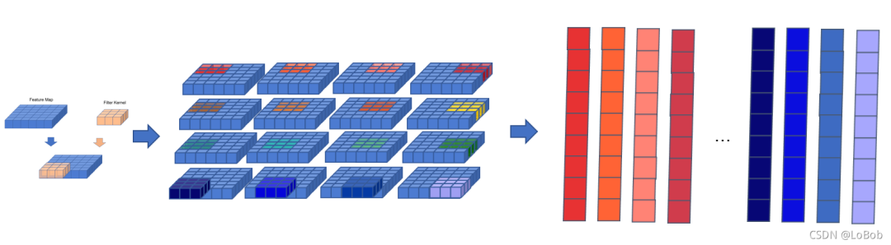

# im2col

## im2col解决了什么问题？

> 使用im2col可以非常优雅的实现卷积操作。

卷积操作通常需要卷积核在一个矩阵上不断移动才能完成，这个过程不仅在代码的编写上非常繁琐而且产生了大量的Gemm运算。

im2col的主要思想就是将矩阵按照卷积核的形状展开为一个新的矩阵，将矩阵展开之后，就能够将卷积操作转化为通用的矩阵乘法，从而通过一次Gemm运算就能够完成整个卷积操作。并且能够充分利用各种高性能计算库所提供的经过深度优化的Gemm算法。

**注意**
+ im2col只是一个将多维矩阵展开的方法,im2col的过程中没有发生图像数据与卷积核的相互运算。