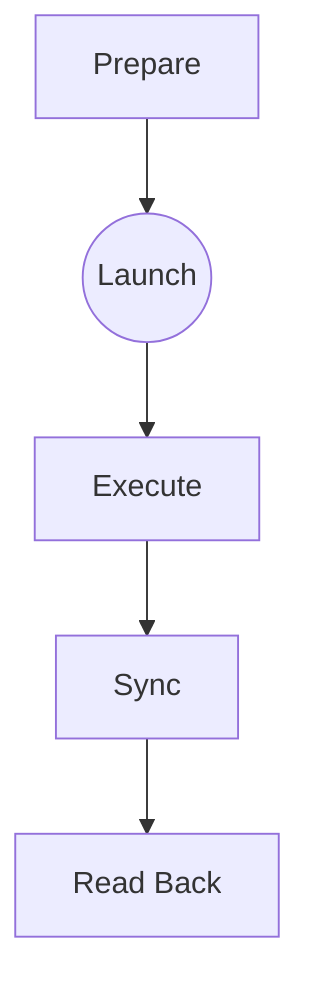

# 背景
标准的CUDA编程模型大体上可以抽象为

这样的基本流程。在理想情况下，只要计算的workload比较适合数据并行，不存在特别不平衡的划分，并且数据粒度不要太小，这样就能很好地发挥GPU多核的运算性能。但如果底层设备的运算性能非常高，每次完成运算的耗时几乎与kernel launch（~20us数量级）处于相当的水平，那么这种频繁的与host进行交互的工作模式就会带来相对较高的开销，在单个工作线程的场景下会无法打满底层硬件。这种runtime overhead，随着异构计算设备算力的加强，会变得愈发明显。

Persistent Thread（下文简称PT）是一种重要的CUDA优化技巧，能够用于大幅度降低GPU的"kernel launch latency"，降低其Host-Device通讯所带来的额外开销。但由于GPU硬件设计的特性所带来的编程模型限制，导致这种技术没有大规模流行起来。

> **Launch latency**, sometimes called induction time, is the time between requesting an asynchronous task and beginning to execute it. For example, CUDA kernel launch latency could be defined as the time range from the beginning of the launch API call to the beginning of the kernel execution. 

> **Task latency**, or total time, is the time between adding a task to the queue and the task finishing. In this post, we mostly talk about launch latency.

# 参考资料

<li>PT综述论文：<a href="http://www.idav.ucdavis.edu/func/return_pdf?pub_id=1089">Persistent-Threads-Style-Programming-Model-for-GPU-Computing</a>，以及对应的简化版<a href="http://on-demand.gputechconf.com/gtc/2012/presentations/S0157-Persistent-Threads-Style-Programming-Model-for-GPU-Computing.pdf">slides</a>。</li>

