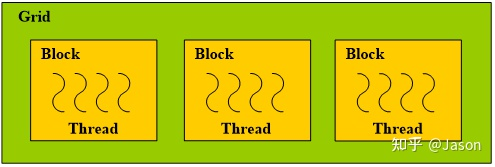
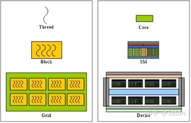

# 线程格、线程块与线程

> 偶然发现了一篇好文章解释了为什么Cuda要按照线程格
、线程块、线程这三种层次进行划分，特此记录。

Grid、Block、Thread的划分方法与GPU的体系结构有着紧密的联系。

## Cuda线程的计算方法

### 二维线程块的计算方法

$$
i = \text{blockIdx.x} \times \text{blockDim.x} + \text{threadIdx.x}
$$

### 三维线程块的计算方法
$$
\begin{split}i = & \text{blockIdx.x} \times \text{blockDim.x} \times \text{blockDim.y} \times \text{blockDim.z} \\
&+ \text{threadIdx.z} \times \text{blockDim.x} \times \text{blockDim.y} \\
&+ \text{threadIdx.y} \times \text{blockDim.x} \\
&+ \text{threadIdx.x}\end{split}
$$

实际设计中，CUDA将这种对应关系规定为：
1. Grid分配到Device上运行；
2. Block分配到SM上运行；
3. Thread分配到Core上运行。

这里的Device指的是整个GPU，一个线程Gird实际上代表完成一个核函数所需要所有线程。

GPU这个计算机集群有一个特点，各个SM之间只能通过全局内存间接通信，没有其它通信的通道，GPU的架构中是没有锁这个概念的
，所以GPU非常适合执行SIMD类型的计算任务。

如果在计算过程中每个SM之间还需要进行同步效率会很低，个人认为这样做背离了发明GPU的初衷。