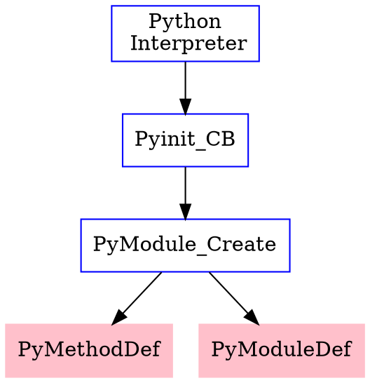

# Python的C拓展

> 在阅读Pytorch

*Pytorch也使用了这种方式使得Python语言能够调用C++算子，但是理解Pytorch的实现方式需要对Python语言内部机制有非常深刻的理解，本人水平有限，目前还无法看懂*

##  操作流程

1. 先用C或C++写好模块的定义、模块函数的映射表
2. 再用python的setuptools包将上面的程序编译到python解释器的路径下面


Python解释器调用包的流程示意图如下：




##  示例代码

C++端代码

```cpp
#include <Python.h>

static PyObject *example_mul(PyObject *self, PyObject *args) {
    float a, b;
    if (!PyArg_ParseTuple(args, "ff", &a, &b)) {
        return NULL;
    }
    return Py_BuildValue("f", a * b);
}

static PyObject *example_div(PyObject *self, PyObject *args) {
    float a, b;
    if (!PyArg_ParseTuple(args, "ff", &a, &b)) {
        return nullptr;
    }
    return Py_BuildValue("f", a / b);  // to deal with b == 0
}


static char mul_docs[] = "mul(a, b): return a*b\n";
static char div_docs[] = "div(a, b): return a/b\n";

static PyMethodDef example_methods[] =
        {
                {"mul", (PyCFunction) example_mul, METH_VARARGS, mul_docs},
                {"div", (PyCFunction) example_div, METH_VARARGS, div_docs},
                {NULL, NULL, 0, NULL}
        };
static struct PyModuleDef cbmodule = {
        PyModuleDef_HEAD_INIT,
        "CB",
        "Python interface for the fputs C library function",
        -1,
        example_methods
};

PyMODINIT_FUNC PyInit_CB(void) {
    PyObject *m = PyModule_Create(&cbmodule);
    return m;
}


```

**特别注意**

+ **PyInit_\*\***这个函数下划线之后的内容必须与PyModuleDef中定义的module的名称一致。

Python端代码

```python
from setuptools import setup,Extension

setup(
    name='CB',
    ext_modules=[
        Extension(
            name='CB',  # type=str。并且还支持层级命名，如myapp.foo
            sources=['pylearn.cpp'],  # type=list[str]。源代码的文件名，可以用glob.glob查找所有.c文件
        )]
)
```

**特别注意**

+ Extension中name的内容也必须和PyModuleDef中定义的module的名称一致。


##  Py_BuildValue

Py_BuildValue()函数的作用和PyArg_ParseTuple()的作用相反，它是将C类型的数据结构转换成Python对象，该函数的原型:

PyObject *Py_BuildValue(char *format, ...)


该函数可以和PyArg_ParseTuple()函数一样识别一系列的格式串，但是输入参数只能是值，而不能是指针。它返回一个Python对象。

```python
Py_BuildValue("")  None
 
Py_BuildValue("i", 123)  123
 
Py_BuildValue("iii", 123, 456, 789)  (123, 456, 789)
 
Py_BuildValue("s", "hello")  'hello'
 
Py_BuildValue("ss", "hello", "world")  ('hello', 'world')
 
Py_BuildValue("s#", "hello", 4) 'hell'
 
Py_BuildValue("()")  ()
 
Py_BuildValue("(i)", 123)  (123,)
 
Py_BuildValue("(ii)", 123, 456) (123, 456)
 
Py_BuildValue("(i,i)", 123, 456) (123, 456)
 
Py_BuildValue("[i,i]", 123, 456) [123, 456] 
 
Py_BuildValue("{s:i,s:i}", "abc", 123, "def", 456) {'abc': 123, 'def': 456}
 
Py_BuildValue("((ii)(ii)) (ii)", 1, 2, 3, 4, 5, 6) (((1, 2), (3, 4)), (5, 6))
```


