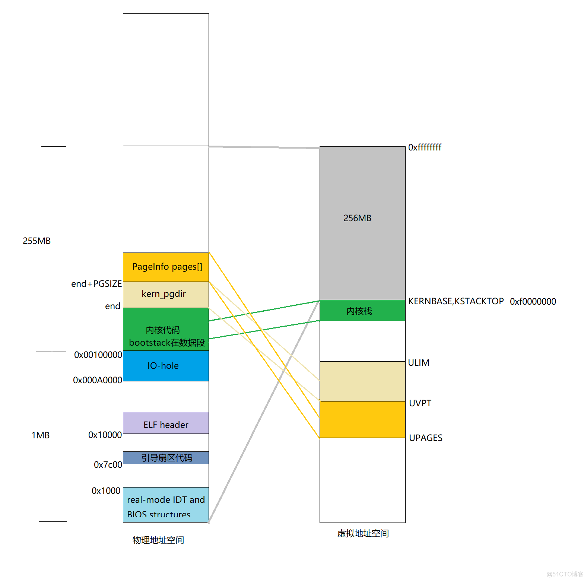

# lab2记录


**内核目标文件段描述**：
```sh
obj/kern/kernel:     file format elf32-i386

Sections:
Idx Name          Size      VMA       LMA       File off  Algn
  0 .text         0000216d  f0100000  00100000  00001000  2**4
                  CONTENTS, ALLOC, LOAD, READONLY, CODE
  1 .rodata       00000944  f0102180  00102180  00003180  2**5
                  CONTENTS, ALLOC, LOAD, READONLY, DATA
  2 .stab         00005365  f0102ac4  00102ac4  00003ac4  2**2
                  CONTENTS, ALLOC, LOAD, READONLY, DATA
  3 .stabstr      00001cf2  f0107e29  00107e29  00008e29  2**0
                  CONTENTS, ALLOC, LOAD, READONLY, DATA
  4 .data         00009300  f010a000  0010a000  0000b000  2**12
                  CONTENTS, ALLOC, LOAD, DATA
  5 .got          00000008  f0113300  00113300  00014300  2**2
                  CONTENTS, ALLOC, LOAD, DATA
  6 .got.plt      0000000c  f0113308  00113308  00014308  2**2
                  CONTENTS, ALLOC, LOAD, DATA
  7 .data.rel.local 00001000  f0114000  00114000  00015000  2**12
                  CONTENTS, ALLOC, LOAD, DATA
  8 .data.rel.ro.local 00000060  f0115000  00115000  00016000  2**5
                  CONTENTS, ALLOC, LOAD, DATA
  9 .bss          00000654  f0115060  00115060  00016060  2**5
                  CONTENTS, ALLOC, LOAD, DATA
 10 .comment      0000002b  00000000  00000000  000166b4  2**0
                  CONTENTS, READONLY

```

## 虚拟内存映射机制


lab2的最终目的是为了得到以下的内存映射



在这里需要注意的是JOS的内存大小实际上只有128MB,远远小于这个图中所显示出的256MB内存。
个人猜测这是因为设计者认为用不了这么大的内存空间所以才会


### 问了


