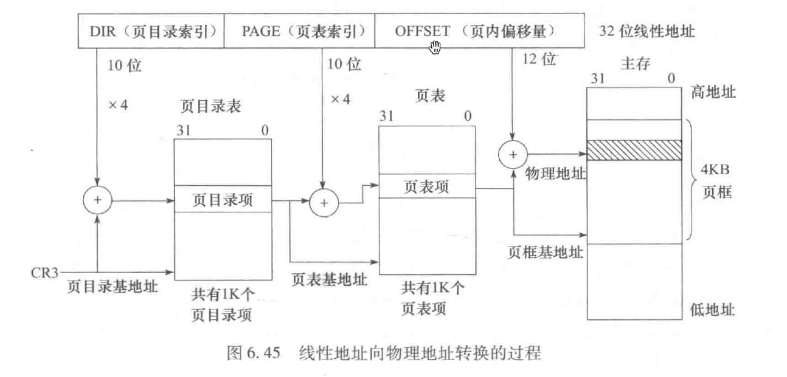
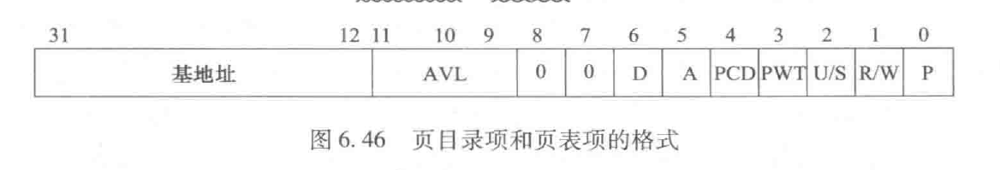

#  页表与页表项

> 中文网络环境里鲜有详细描述页表与页表项的内容的博客，特在此记录

##  页表项与页目录项

*页表项中的最后三位在6.828实验中发挥了重要作用。*

+ **P** : **P=1**表示页表或页在主存中。0就代表不在主存中，如果需要访问的页不在主存中就会发生页故障，即著名的**缺页异常**，此时就需要将页故障地址记录在**CR2**中。操作系统在处理页故障时会将缺失的页表或页从硬盘装入主存中，并重新执行引起页故障的指令。
+ **R/W** : 这一位为0时表示页表或页只能读不能写；为1表示即可又可以写。
+ **U/S** : 该位为0时表示用户进程不能访问，为1时允许用户进程访问。该位可以保护操作系统所使用的页不受用户进程的破坏。

+ **基地址**：这里的基地址指的是物理地址的高20位地址。
