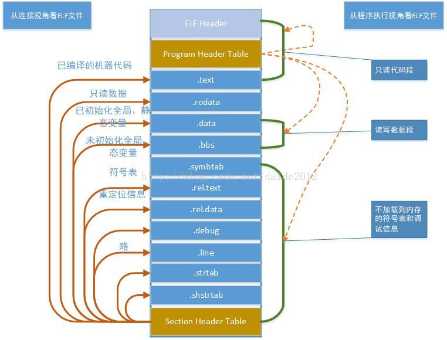

# ELF文件格式



## 节头部表

```c
typedef struct{
    Elf32_Word sh_name;   //节区名，是节区头部字符串表节区（Section Header String Table Section）的索引。名字是一个 NULL 结尾的字符串。
    Elf32_Word sh_type;    //为节区类型
    Elf32_Word sh_flags;    //节区标志
    Elf32_Addr sh_addr;    //如果节区将出现在进程的内存映像中，此成员给出节区的第一个字节应处的位置。否则，此字段为 0。
    Elf32_Off sh_offset;    //此成员的取值给出节区的第一个字节与文件头之间的偏移。
    Elf32_Word sh_size;   //此 成 员 给 出 节 区 的 长 度 （ 字 节 数 ）。
    Elf32_Word sh_link;   //此成员给出节区头部表索引链接。其具体的解释依赖于节区类型。
    Elf32_Word sh_info;       //此成员给出附加信息，其解释依赖于节区类型。
    Elf32_Word sh_addralign;    //某些节区带有地址对齐约束.
    Elf32_Word sh_entsize;    //某些节区中包含固定大小的项目，如符号表。对于这类节区，此成员给出每个表项的长度字节数。
}Elf32_Shdr;

```

## 程序执行头部表

```c
typedef struct {  
    Elf32_Word p_type;           //此数组元素描述的段的类型，或者如何解释此数组元素的信息。 
    Elf32_Off  p_offset;           //此成员给出从文件头到该段第一个字节的偏移
    Elf32_Addr p_vaddr;         //此成员给出段的第一个字节将被放到内存中的虚拟地址
    Elf32_Addr p_paddr;        //此成员仅用于与物理地址相关的系统中。System V忽略所有应用程序的物理地址信息。
    Elf32_Word p_filesz;         //此成员给出段在文件映像中所占的字节数。可以为0。
    Elf32_Word p_memsz;     //此成员给出段在内存映像中占用的字节数。可以为0。
    Elf32_Word p_flags;         //此成员给出与段相关的标志。
    Elf32_Word p_align;        //此成员给出段在文件中和内存中如何对齐。
} Elf32_phdr;

```


