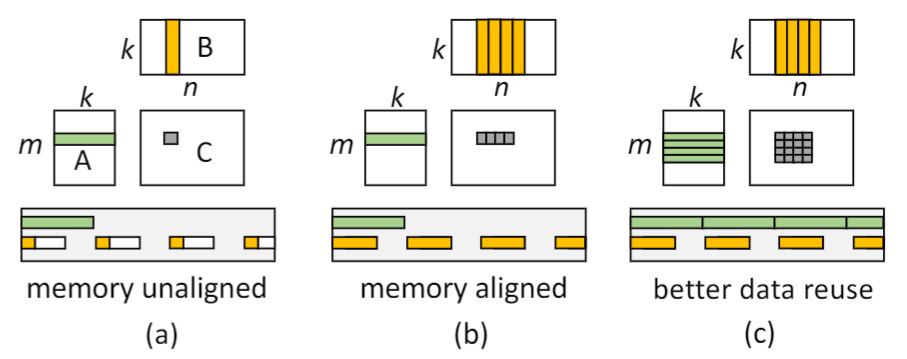

#  Roller : Fast and Efficient Tensor Compilation for Deep Learning

##  背景简介
本文提出了一种新型的编译器可以更好的根据GPU等加速器内存层次结构的特点加速算子计算的流程

这篇文章基于这样的一个事实展开:对于一个常见的矩阵乘法运算，矩阵数据在内存中对齐的方式会严重影响矩阵运算的性能从而制约算子运算的效率。
如上图所示，a、b、c三种不同的对齐方式会影响内存读写的次数，从而影响矩阵运算的效率。

如果在编译期阶段就考虑到优化矩阵在内存中的对齐方式，那么就能够大大加快DNN模型的推理速度。

## rTile
rTile是本文所提出的概念，rTile是优化矩阵在内存中排列方式的直接对象。

+ Alignment with the hardware execution unit.
+ Alignment with memory transaction.
  A data tile’s shape should align with the length of memory transaction for optimal memory access.
+ Alignment with memory bank
+ Alignment with tensor shape.

# 我的感想
+ 完全不理解它是通过什么样的方法满足这么多关于 **Align**的要求
+ Roller还使用了TVM的Tensor表达语句，不太清楚这到底是怎么用的？？
