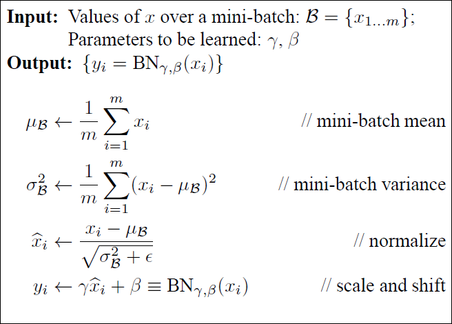

> 学了将近三年的深度学习，到现在我才理解这个概念。
> 不从代码层面上理解永远也不能称得上是真正理解。

# 原理


[一篇很好的文章](https://zhuanlan.zhihu.com/p/522525435)




## BN到底归一化了谁？

对一个批次的所有样本的同一个维度求平均值以及求方差，即**归一化**。

假设我们手上有一个Batch的数据(一个Batch的形状通常为$N\times D$,$N$代表样本的数量，$D$代表样本的特征维度)。
$$
\left[\begin{array}{c:c:c:c:c}
x^{[1]}_1 & x^{[2]}_1 & x^{[3]}_1 & x^{[4]}_1& x^{[5]}_1\\
x^{[1]}_2 & x^{[2]}_2 & x^{[3]}_2 & x^{[4]}_2& x^{[5]}_2\\
x^{[1]}_3 & x^{[2]}_3 & x^{[3]}_3 & x^{[4]}_3& x^{[5]}_3\\
x^{[1]}_4 & x^{[2]}_4 & x^{[3]}_4 & x^{[4]}_4& x^{[5]}_4\\
\end{array}\right]
$$
+ 求同一列数据的平均值以及方差
  

```python

import numpy as np

def batchnorm(X,params,mode):
    mode = mode
    D,N = params.shape
    running_mean = params.get('running_mean', np.zeros(D,dtype=X.dtype))
    running_var = params.get('running_var', np.zeros(D,dtype=X.dtype))
    gamma = params.get('gamma')
    beta = params.get('beta')
    eps = params.get('eps', 1e-5)
    if mode=='train':
        samples_mean = np.mean(X, axis=0)#对同一个维度求平均值
        samples_var = np.var(X, axis=0)#对同一个维度求方差
        out_ = (X - samples_mean) / (np.sqrt(samples_var) + eps)
        momentum = params.get('momentum')
        out = gamma * out_ + beta
        running_mean = momentum * running_mean + (1 - momentum) * samples_mean
        running_var = momentum * running_var + (1 - momentum) * samples_var
        params['running_mean'] = running_mean
        params['running_var'] = running_var
    elif mode=='test':
        out_ = (X-running_mean)/(running_var+eps)
        out = gamma*out_+beta
    return out


```