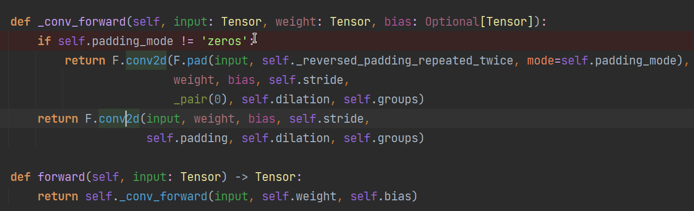
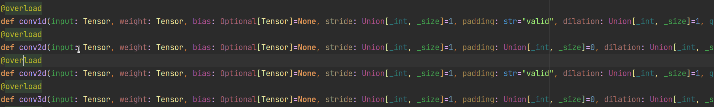

#  Pyi文件格式

> 在阅读Pytorch源码时接触到了Pyi文件格式，在这里写文章来记录一下。

##  事件来由

当阅读pytorch中卷积算子的具体方法时，我遇到了这样的情况。首先，通过Pycharm的代码搜索功能我们能够刚看到在python端，卷积算子使用这样的方法进行前向计算。

点进去之后观察F.conv2d的源码，惊讶的发现源码文件里面竟然只有函数的定义而没有函数的实现。

这是因为这里的文件不是普通的python文件，而是pyi格式的文件。

##  pyi文件解决了什么问题 ？

我个人理解pyi文件的作用师为了解决python无法执行**静态类型检查**的问题。

我们以C++与python作比较。作为一种静态编译性语言，C++会在编译阶段对代码进行类型检查，比如函数参数的类型，函数返回值的类型等等。而python作为解释性语言只能在代码开始运行之后才会得知变量的具体类型，这样的话就会给程序设计带来潜在的问题。因为当代码的数量非常多的时候，一个bug拖到运行阶段才被发现将会是非常低效的，所以为了解决python解决这个问题，工程师便提出了pyi这个概念。

